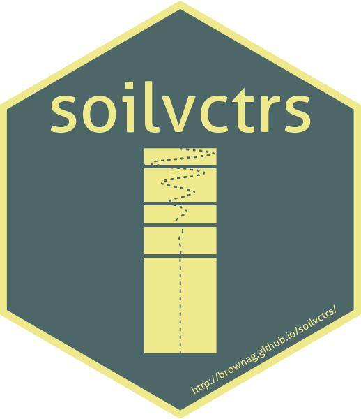

[](https://www.tidyverse.org/lifecycle/#experimental)
[](https://codecov.io/github/brownag/soilvctrs)
[](https://travis-ci.org/brownag/soilvctrs)
[](https://choosealicense.com/licenses/mit/)

## Package: soilvctrs (0.0.0.1)
### Geometric operations on stratified environmental data
### Author: Andrew G. Brown

#### Purpose

_soilvctrs_ is an experimental R package to abstract geometric operations on stratified environmental data [such as soil profile descriptions]. Under the hood, _soilvctrs_ uses [vctrs](https://cran.r-project.org/web/packages/vctrs/index.html) and [geovctrs](https://github.com/paleolimbot/geovctrs)! This package development is very much a learning _process_ and and a work in _progress_. Things may be rearranged, organized or removed at any time. 



##### Install the development version of the package

```
install.packages("remotes")
remotes::install_github("brownag/soilvctrs")
```

##### Getting started

```
library(soilvctrs)
library(tibble)

# layer data                                        ## SOIL LAYERS:
layers <- tibble(pid  = c(1,1,1,2,2,3,3),           # - unique profile IDs
                 ztop = c(0,25,50,0,18,0,50),       # - layer upper boundaries
                 zbot = c(25,50,190,18,90,50,90))   # - layer lower boundaries

# site data                                         ## SITE PROPERTIES:
sites <- tibble(pid = c(1,2,3),                     # - unique profile IDs 
                x   = c(37,38,37), y = c(34,35,36), # - XY coordinates
                z   = c(203,224,212))               # - elevation

# construct a soil_layer from a data.frame-like object
horizons <- soil_layer(layers)

# construct a soil_profile vctr from data.frame-like objects
profiles <- soil_profile(layers, sites)
```

The primary goal of this package is to demonstrate concise soil-themed classes that “just work” with `tidyverse` principles. There is an opportunity to show "new" ways soil algorithms can be implemented: using efficient vctrs representations of properties and geometry.

#### Classes defined by this package

The current `soilvctrs` implementation represents parts of soil descriptions as S3 `vctrs::rcrd` objects: `soil_layer` and `soil_profile`. 

`soil_profile` instances contain a `vctrs::list_of` `soil_layer` in the field `$profile` with length zero or more. `geom` fields are defined at both profile and layer levels to visualize and analyze associated data and can also be zero-length. 

##### `soil_layer`

A `soil_layer` (with non-empty geometry) contains three fields: `pid` (profile ID: _integer_), `hid` (layer or horizon ID: _integer_), `geom` (layer or horizon geometry: _geovctrs_rect_). `geom` is computed from the input boundary data. If you use the constructor without any input data, you obtain a `list_of<soil_layer>` vector.

```
soil_layer()

# <list_of<soil_layer>[0]>
```

`soil_layer` vectors with length greater than zero can be constructed from data (`data.frame` subclasses + metadata) via `soil_layer()`. Each element of the `list`, presuming there were valid data entered, is a `soil_layer` with length equal to the appropriate number of layers grouped into vctrs by `pid`. 

Note that the internal constructor `.new_soil_layer` is hidden -- but can be used via `soilvctrs:::.new_soil_layer`. Generally, it is thought that the `soil_layer` method producing the geometry and keeping parity with `pid` will be convenient. One can concatenate different parts of single-`pid` vectors together using `c`.

```
layer <- data.frame(pid = c(1,1,2), ztop = c(0,10,0), zbot = c(10,50,50))

the.layers <- soil_layer(layer)
the.layers

# <list_of<soil_layer>[2]>
# [[1]]
# soil_layer<2> with 5 fields and 1 attributes
# Fields: pid, hid, ztop, zbot, geom
# Attributes: pid
# 
# [[2]]
# soil_layer<1> with 5 fields and 1 attributes
# Fields: pid, hid, ztop, zbot, geom
# Attributes: pid

# 2nd layer from first profile, 1st layer from 2nd profile in same vctr
c(the.layers[[1]][2], the.layers[[2]][1])
```

##### `soil_profile`
 
The `pid` field matches the `pid` found in the `soil_layer` vector `profile`. `geom` is a `geovctrs_xyz` ternary coordinate. Three additional attributes (beyond those created in the `soil_layer`) can be found in the `soil_profile` -- these are the names of the columns in the input data that contained X, Y and Z coordinates of the site. 

You can use the `plot` method directly on a `soil_profile` to see all profiles tessellated and colored based on layer index. If unit-width rectangular geometries are used [default, currently not easily modifiable] for horizon/layer representation the primary geometric variable by layer is vertical depth "thickness." Applying scaling factors to width in this model is analogous to applying depth-weighting while preserving the geometry in Z. It is an interesting angle to consider for a set of profile geometries tessellated along an axis.

```
> soil_profile()

# soil_profile<0> with 3 fields and 7 attributes
# Fields: pid, profile, geom
# Attributes: pid, x, y, z, hid, ztop, zbot
```

The `soil_layer` and `soil_profile` are comprised of vector "fields" of length equal to number of horizons (in a profile) or number of profiles, respectively.

The beauty of `rcrd` objects is that despite supporting arbitrary hierarchical complexity they are able to be manipulated like any `vctr`, added as columns in `tibble` data.frame subclasses and more.

The specific `soil_layer` and `soil_profile` classes also (at least outwardly) draw some syntax from from the `data.frame` / `tibble`, define custom (rudimentary) plot / print / format methods. S3 methods including `$`, `[[`, `[`, and their `<-` counterparts are available for operations involving field names, indexes, access and replacement. There is still much more to be done to enhance how these objects interact with various `geovctrs` and `dplyr` functions.

#### Examples

```
# soil_profile plot method (default color by layer number within profile)
plot(profiles)

# "spatial" plot, using raw xy coordinates from geovctrs_xyz geom
plot(profiles$geom)

# get just first profile
first_profile <- profiles[[1]]

# get first TWO profiles
two_profiles <- profiles[1:2,]

# get a tbl_df with pid <int> and geom <xyz> for profiles 1 and 3
profiles[c(1,3), c("pid", "geom")]

# # A tibble: 2 x 2
#     pid        geom
#   <int>       <xyz>
# 1     1 (37 34 203)
# 2     3 (37 36 212)

# get the soil_layer from first_profile
first_layers <- first_profile$profile

# soil_layer plot method
plot(first_layers)

# horizon ID (hid) is calculated and added if not present in the data
first_layers$hid

# replace a value with $
first_layers$hid <- rev(first_layers$hid)

# use j index (single colname) to get just a vector
first_layers[,"hid"]
```
	
#### On similarities to `aqp`...

`soilvctrs` deliberately has less scope than `aqp` and imports only a couple libraries (`vctrs`, `geovctrs`) -- potentially useful for _extension_ in other packages. Further use of _nested_ `geovctrs` and the ability to directly manipulate profile geometric elements _outside_ of a graphics device has exciting (still theoretical) implications for _interactive_ profile plots, 2-dimensional profile descriptions and new algorithm design. This experiment is leveraging knowledge and experience I (Andrew) have gained as a major contributor to the Algorithms for Quantitative Pedology ([aqp](http://ncss-tech.github.io/AQP/)) project. For experimental reasons, I intend to "reproduce" core "bookkeeping" and graphical code with the goal of exploring new capabilities in an unconstrained way.

The visual representation of soil profile sketches via Dylan Beaudette's `aqp::plotSPC` is a major conceptual inspiration for this work on `soilvctrs`. I thank Dylan and other contributors to the AQP suite of R packages (_aqp_, _soilDB_, _sharpshootR_) for constant inspiration and much opportunity. As a contributor to `aqp`, I have no intention of superseding or "competing" with it in in this package. 
